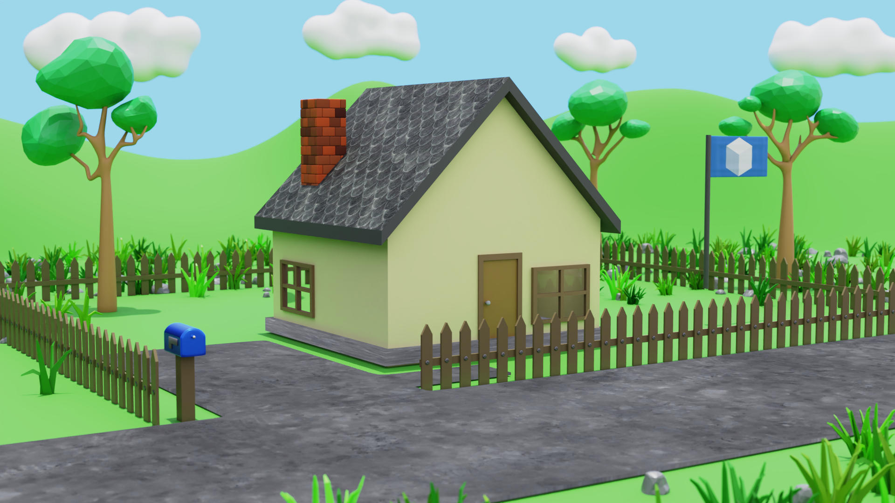

# Blender Simple 3D House Model

## Overview

This repository contains a simple 3D house model created using Blender. The project was developed by following the [Blender Complete Beginner Tutorial Series](https://www.youtube.com/watch?v=gyPHCDPvkoI&list=PLsGl9GczcgBtK0EKjiHyM_86DIFrHocF1) by Ryan King.

## Features

- **Modeling:** Basic 3D model of a simple house and environment.
- **Texturing:** Applied textures to enhance visual appeal.
- **Lighting:** Basic scene lighting setup for rendering.
- **Rendering:** Configured for standard output.
